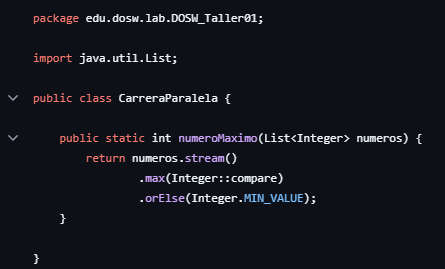
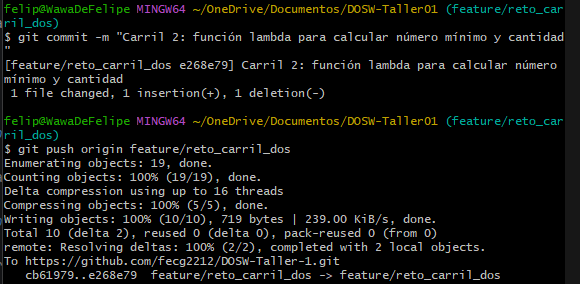
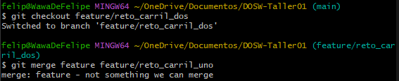
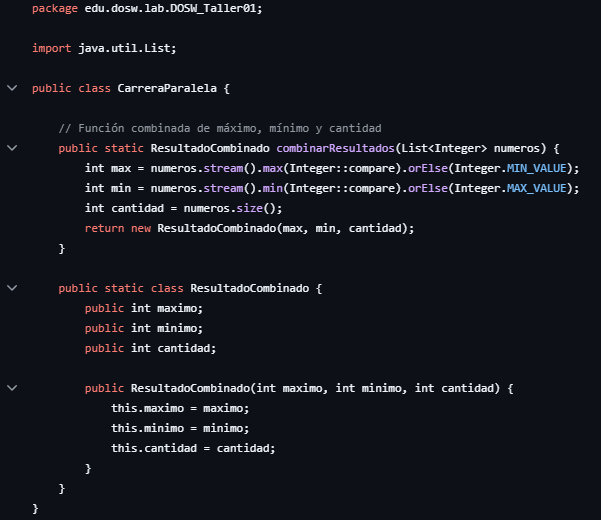
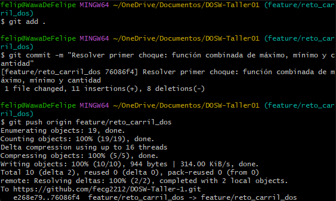
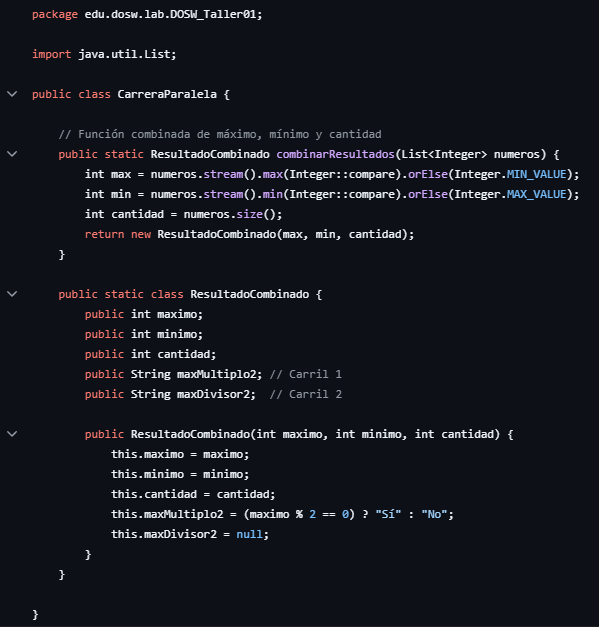
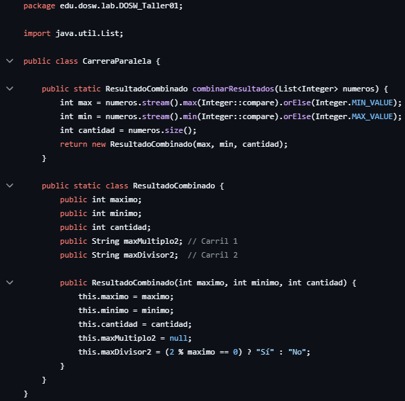
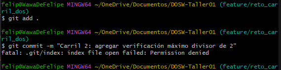
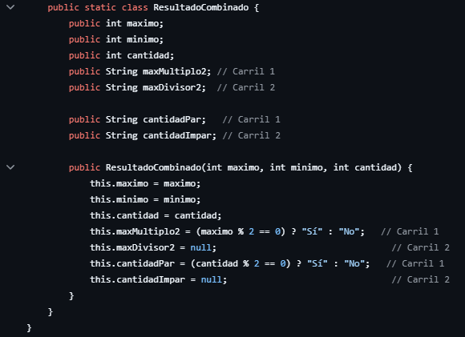
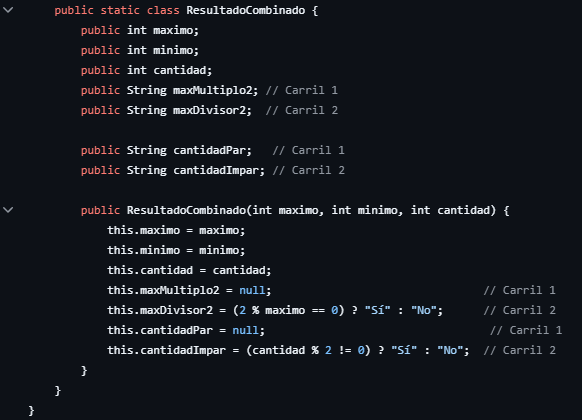

# DOSW - Taller 01

## Hackathon Express 2025-2

## Parte 2

- Creamos el repositorio remoto y lo configuramos localmente también para empezar a crear
las ramas necesarias para realizar los 6 retos con el
comando 'git checkout nombre_rama'

## Reto #1: La bienvenida
Definimos un objeto estudiante con atributos básicos: nombre, edad, correo y semestre.
- Creamos un constructor para inicializar esos atributos.
- Tiene getters para acceder a ellos desde otras clases.

Tiene un método generarMensaje(List) que:
- Recibe una lista de estudiantes.
- Crea un mensaje de bienvenida combinando los nombres, edades, semestres y correos delos estudiantes.
- Devuelve el mensaje completo como un String.

Por último usamos el comando 'mvn clean spring-boot:run' para compilarlo con maven dándonos la salida esperada

## Reto #2: Carrera en Paralelo

**Estudiante A:** Cambiamos el nombre de Application para el reto 2 a CarreraParalela.java
y luego creamos las subramas desde el feature del reto 2

Y por último realizamos el commit inicial con la estructura base

**Estudiante B:** Arrancamos actualizando nuestro carril con los cambios subidos en el feature

Y se realiza la función

**Estudiante A:** Actualizamos nuestro carril con los cambios del estudiante A y realizamos la función
para calcular el número más pequeño de un listado de números ingresados

Y realizamos el commit correspondiente

### **El primer choque** 
Al intentar mezclar los cambios de la otra rama ocurre un conflicto que toca resolver

Y para eso decidimos crear una función que combine los resultados

Y realizamos el commit

### **Segunda vuelta**

**Carril 1:** Añadimos la función de la verificación de si el numero
mayor es multiplo de 2.

**Carril 2:** Y añadimos la función que verifica si el numero mayor
es divisor de 2.

Y hacemos el commit 

### **Tercer choque**

**Carril 1:** Calculamos si la cantidad de datos de la lista es par

Añadimos los nuevos atributos y los implementamos en el constructor

**Carril 2:** Calculamos si la cantidad de datos es impar

También añadimos los nuevos atributos y modificamos el constructor

### **La gran meta**

