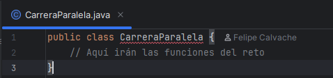
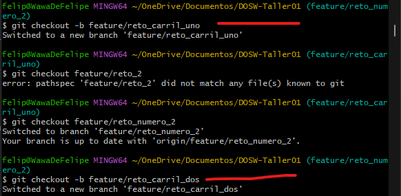
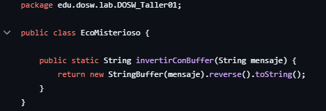
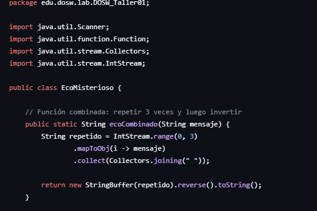

# DOSW - Taller 01

## Hackathon Express 2025-2

## Parte 2

- Creamos el repositorio remoto y lo configuramos localmente también para empezar a crear
las ramas necesarias para realizar los 6 retos con el
comando 'git checkout nombre_rama'

## Reto #1: La bienvenida
Definimos un objeto estudiante con atributos básicos: nombre, edad, correo y semestre.
- Creamos un constructor para inicializar esos atributos.
- Tiene getters para acceder a ellos desde otras clases.

Tiene un método generarMensaje(List) que:
- Recibe una lista de estudiantes.
- Crea un mensaje de bienvenida combinando los nombres, edades, semestres y correos delos estudiantes.
- Devuelve el mensaje completo como un String.

Por último usamos el comando 'mvn clean spring-boot:run' para compilarlo con maven dándonos la salida esperada

## Reto #2: Carrera en Paralelo

**Estudiante A:** Cambiamos el nombre de Application para el reto 2 a CarreraParalela.java
y luego creamos las subramas desde el feature del reto 2

Y por último realizamos el commit inicial con la estructura base

**Estudiante B:** Arrancamos actualizando nuestro carril con los cambios subidos en el feature

Y se realiza la función

