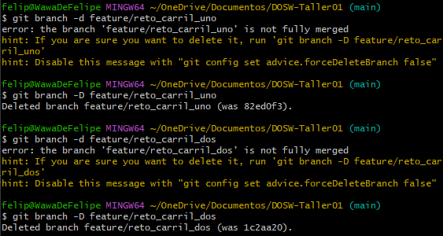
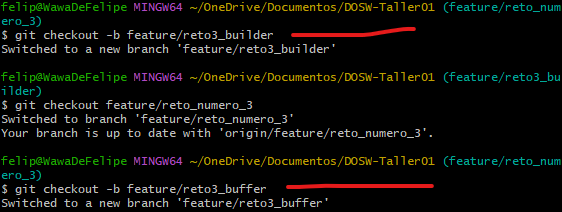
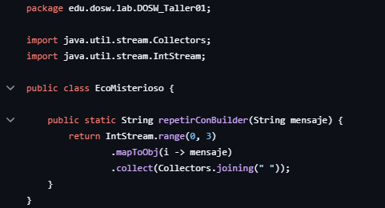
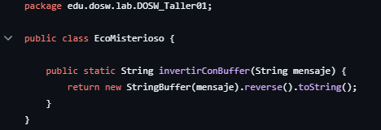
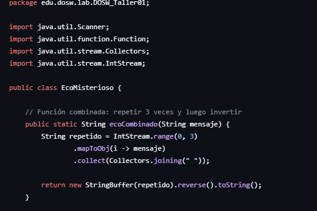
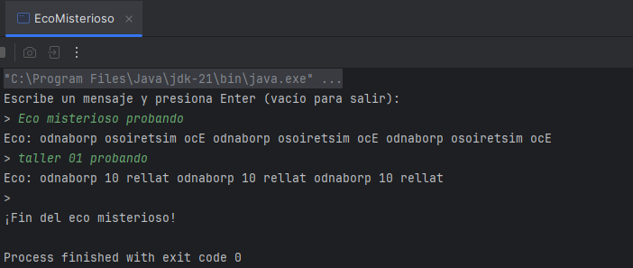
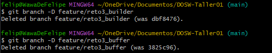

# DOSW - Taller 01

## Hackathon Express 2025-2

## Parte 2

- Creamos el repositorio remoto y lo configuramos localmente también para empezar a crear
las ramas necesarias para realizar los 6 retos con el
comando 'git checkout nombre_rama'


## Reto #1: La bienvenida
Definimos un objeto estudiante con atributos básicos: nombre, edad, correo y semestre.
- Creamos un constructor para inicializar esos atributos.
- Tiene getters para acceder a ellos desde otras clases.

Tiene un método generarMensaje(List) que:
- Recibe una lista de estudiantes.
- Crea un mensaje de bienvenida combinando los nombres, edades, semestres y correos delos estudiantes.
- Devuelve el mensaje completo como un String.

Por último usamos el comando 'mvn clean spring-boot:run' para compilarlo con maven dándonos la salida esperada


## Reto #2: Carrera en Paralelo

**Estudiante A:** Cambiamos el nombre de Application para el reto 2 a CarreraParalela.java
y luego creamos las subramas desde el feature del reto 2


Y por último realizamos el commit inicial con la estructura base


**Estudiante B:** Arrancamos actualizando nuestro carril con los cambios subidos en el feature


Y se realiza la función


**Estudiante A:** Actualizamos nuestro carril con los cambios del estudiante A y realizamos la función
para calcular el número más pequeño de un listado de números ingresados


Y realizamos el commit correspondiente


### **El primer choque** 
Al intentar mezclar los cambios de la otra rama ocurre un conflicto que toca resolver


Y para eso decidimos crear una función que combine los resultados


Y realizamos el commit


### **Segunda vuelta**

**Carril 1:** Añadimos la función de la verificación de si el numero
mayor es multiplo de 2.


**Carril 2:** Y añadimos la función que verifica si el numero mayor
es divisor de 2.


Y hacemos el commit 


### **Tercer choque**

**Carril 1:** Calculamos si la cantidad de datos de la lista es par

Añadimos los nuevos atributos y los implementamos en el constructor


**Carril 2:** Calculamos si la cantidad de datos es impar

También añadimos los nuevos atributos y modificamos el constructor


### **La gran meta**

Ahora empezamos a fusionar los 2 carriles al feature del reto
y probamos el código para ver si sí se implementó bien.


Y por último eliminamos las sub ramas



## Reto #3: El eco misterioso

### Misión

### **Estudiante A:** 
Creamos las sub rama y un método usando StringBuilder





### **Estudiante B:**
Creamos un método usando StringBuffer



### **Primer choque**
Realizamos el merge y resolvemos el conflicto  para combinar ambas transformaciones y dejarlo en el feature del reto



Ya después realizamos la respectiva clase para probar la implementación del código



Y por último eliminamos las sub ramas



## Reto #4: El tesoro de las llaves duplicadas

1. **Primer estudiante:**
	- Crea el método `crearHashMap` en la clase `MapaHash`.
	- Este método recibe una lista de pares clave-valor (`String`, `Integer`) y los almacena en un `HashMap`, ignorando claves duplicadas (conserva el primer valor encontrado).

2. **Segundo estudiante:**
	- Crea el método `crearHashtable` en la clase `MapaHashtable`.
	- Este método recibe una lista de pares clave-valor y los almacena en un `Hashtable`, asegurando la sincronización e ignorando claves duplicadas.

3. **Ambos estudiantes:**
	- Actualizan la rama feature del reto.
	- Crean el método `combinarYImprimir` en la clase `MapaCombinado` que recibe ambos mapas y los combina en uno solo.
	- Si hay conflicto en las claves, se priorizan los valores del `Hashtable`.

4. **Resolución de conflictos:**
	- Se realiza merge y se resuelven los conflictos dejando una sola versión unificada del método de combinación.

5. **Mejoras individuales:**
	- El estudiante A añade la función que convierte todas las claves a mayúsculas antes de imprimir.
	- El estudiante B añade la función que ordena las claves de forma ascendente antes de imprimir.

6. **Función final combinada:**
	- Se combinan ambas mejoras en una sola función (`combinarYImprimir`) que:
	  - Combina `HashMap` y `Hashtable`.
	  - Prioriza los valores del `Hashtable` en caso de conflicto.
	  - Convierte las claves en mayúsculas.
	  - Imprime en orden ascendente de clave usando `Collectors.toMap()` y expresiones lambda.

### Ejemplo de uso

El método `main` en `Application.java` muestra cómo usar las clases y métodos desarrollados:

```java

java.util.List<java.util.AbstractMap.SimpleEntry<String, Integer>> listaHash = java.util.Arrays.asList(
	 new java.util.AbstractMap.SimpleEntry<>("oro", 5),
	 new java.util.AbstractMap.SimpleEntry<>("plata", 3),
	 new java.util.AbstractMap.SimpleEntry<>("oro", 7),
	 new java.util.AbstractMap.SimpleEntry<>("diamante", 10)
);
java.util.List<java.util.AbstractMap.SimpleEntry<String, Integer>> listaTable = java.util.Arrays.asList(
	 new java.util.AbstractMap.SimpleEntry<>("plata", 8),
	 new java.util.AbstractMap.SimpleEntry<>("rubí", 4),
	 new java.util.AbstractMap.SimpleEntry<>("oro", 12),
	 new java.util.AbstractMap.SimpleEntry<>("esmeralda", 6)
);

java.util.HashMap<String, Integer> hashMap = MapaHash.crearHashMap(listaHash);
java.util.Hashtable<String, Integer> hashTable = MapaHashtable.crearHashtable(listaTable);
System.out.println("--- Resultado combinado ---");
MapaCombinado.combinarYImprimir(hashMap, hashTable);

```

### Salida esperada

```
--- Resultado combinado ---
Clave: DIAMANTE | Valor: 10
Clave: ESMERALDA | Valor: 6
Clave: ORO | Valor: 12
Clave: PLATA | Valor: 8
Clave: RUBÍ | Valor: 4
```

## Parte 3 - Cuestionario:

### 1. Cuál es la diferencia entre git merge y git rebase
Cuando trabajamos con Git y tienes una rama de desarrollo que quieres integrar con otra, como main, podemos hacerlo de dos formas principales: usando merge o rebase. Aunque ambas buscan el mismo objetivo lo hacen de manera muy distinta.

Por otro lado, git rebase reescribe el historial. Lo que hace es tomar los commits de la rama y “reaplicarlos” como si hubieran sido creados directamente sobre la rama base. Esto da como resultado un historial mucho más limpio y lineal, sin commits de fusión.

En resumen, merge respeta el pasado y lo documenta, mientras que rebase lo reescribe para que parezca más ordenado.

### 2. Si dos ramas modifican la misma línea de un archivo ¿Qué sucede al hacer merge? 
Cuando dos ramas modifican la misma línea de un archivo, Git no puede decidir automáticamente cuál versión conservar. Al intentar hacer git merge, se produce un conflicto de fusión.

Git detiene el proceso de merge y marca el archivo como en conflicto, insertando delimitadores visuales en el código para que tú elijas qué versión conservar.

Debemos editar manualmente esa sección, decidir qué contenido queda o podemos combinar ambos si tienen sentido, y luego guardar el archivo.

### 3. ¿Cómo puedes ver gráficamente el historial de merges y ramas en consola?
Para ver gráficamente el historial de ramas y merges en la consola de Git, podemos usar el comando:

git log --graph --oneline --decorate --all

Este comando muestra un diagrama en texto del historial del repositorio, incluyendo bifurcaciones, fusiones y etiquetas. Cada línea representa un commit, y los símbolos como *, |, \, y / indican cómo se conectan las ramas entre sí.

### 4. Explica la diferencia entre un commit y un push?
Cuando hacemos un git commit, estamos registrando los cambios en el repositorio local. Es como decir: “Esto que acabo de modificar, quiero que quede guardado como una versión oficial en mi máquina”. El commit incluye un mensaje que describe lo que hicimos, y forma parte del historial del proyecto, pero solo tú lo ves.

En cambio, cuando hacemos git push, estamos enviando esos commits al repositorio remoto.

### 5. Para que sirve git stash y git pop?
git stash se utiliza para guardar temporalmente los cambios no confirmados en el área de trabajo sin necesidad de hacer un commit. Esto permite cambiar de rama o realizar otras operaciones sin perder el trabajo en curso. Al ejecutar git stash, Git guarda los cambios en una pila especial y deja el directorio de trabajo limpio.

git stash pop se emplea para recuperar los cambios guardados con git stash y aplicarlos nuevamente al área de trabajo. Además de restaurar los cambios, elimina el stash de la pila.

### 6. ¿Qué diferencia hay entre HashMap y HashTable?
HashMap y Hashtable son estructuras de datos en Java que almacenan pares clave-valor y utilizan técnicas de hashing para acceder rápidamente a los elementos.

Hashtable es sincronizado, lo que significa que es seguro para entornos multihilo. Todos sus métodos están sincronizados internamente.

HashMap, en cambio, no es sincronizado, por lo que no es seguro en aplicaciones concurrentes sin sincronización externa

### 7. ¿Qué ventajas tiene Collectors.toMap() frente a un bucle tradicional para llenar un mapa?
La principal ventaja es la concisión. Con Collectors.toMap(), es posible transformar una lista o cualquier flujo de datos en un mapa con una sola línea de código, especificando directamente cómo obtener las claves y los valores. Esto reduce el código repetitivo y mejora la legibilidad.

### 8. ¿Si usas List con objetos y luego aplicas stream().map() que tipo de operación estás haciendo?
Cuando se utiliza stream().map() sobre una List de objetos en Java, se está realizando una operación de transformación. Específicamente, map() es una operación intermedia dentro del flujo de datos que permite aplicar una función a cada elemento del stream, generando un nuevo stream con los resultados.

### 9. ¿Qué hace el método stream().filter() y que retorna?
El método stream().filter() en Java se utiliza para filtrar elementos de un flujo (stream) según una condición lógica definida por un predicado.

Retorna un nuevo Stream que contiene únicamente los elementos que cumplen la condición especificada. Este stream puede ser procesado con otras operaciones como map(), sorted(), o finalizado con collect() para obtener una colección.

### 10. Describe el paso a paso de cómo crear una rama desde develop si es una funcionalidad nueva.

Se sigue este flujo:
- Cambiar a la rama Develop

git checkout Develop

- Crear y cambiar la nueva rama

git checkout -b nombre-de-la-funcionalidad

- Desarrollar la funcionalidad

Se realizan los cambios necesarios en el código, se agregan archivos si es necesario, y se confirman los cambios con commit.

- Enviar la rama al repositorio remoto

git push -u origin nombre-de-la-funcionalidad

### 11. ¿Cuál es la diferencia entre crear una rama con git branch y con git checkout -b?
La diferencia entre git branch y git checkout -b radica en que el primero solo crea la rama, mientras que el segundo la crea y cambia a ella en un solo paso.

### 12. ¿Por qué es recomendable crear ramas feature/ para nuevas funcionalidades en lugar de trabajar en main directamente? 
Crear ramas feature/ para nuevas funcionalidades en lugar de trabajar directamente en main es una práctica recomendada porque permite aislar el desarrollo, proteger la estabilidad del código principal y facilitar la colaboración entre desarrolladores.

Al trabajar en una rama feature/, los cambios relacionados con una funcionalidad específica se mantienen separados del código oficial. Esto evita que errores o código incompleto afecten la rama main, que suele representar la versión estable del proyecto. 
